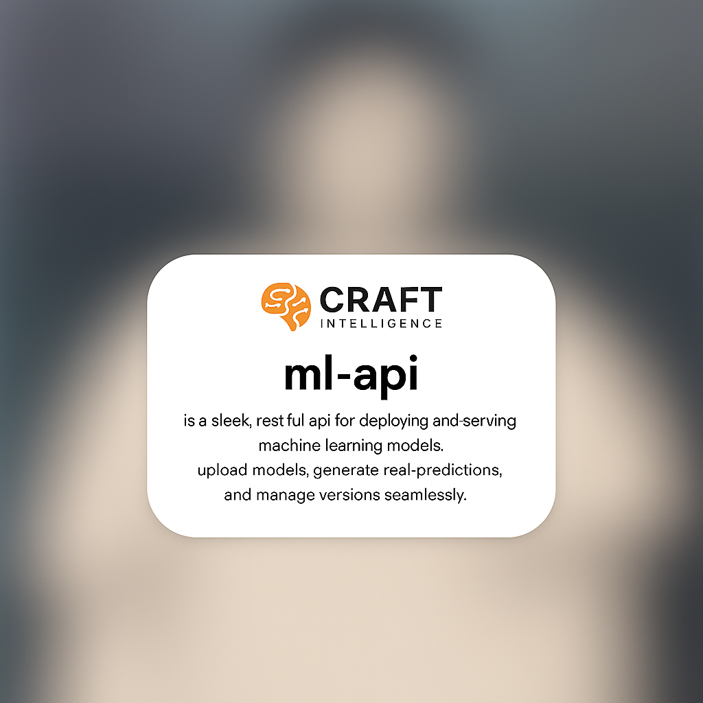

# ml-api  
build, deploy, and scale machine learning with ease.



## features  
- **upload models**: deploy your models effortlessly.  
- **real-time inference**: generate predictions instantly.  
- **version management**: keep your models organized and up to date.  

## get started  
1. clone the repository:  
   ```bash  
   git clone https://github.com/harpertoken/ml-api.git  
   ```

2. navigate to the project:

   ```bash
   cd ml-api  
   ```
3. install dependencies:

   ```bash
   pip install -r requirements.txt  
   ```

## deploy the web interface

```bash
kubectl apply -f k8s.yaml
```

## run the api

launch the server with:

```bash
python main.py  
```

### example request

```bash
curl -X POST http://localhost:8000/chat -H "Content-Type: application/json" -d '{"prompt": "Hello, world!"}'
```

### additional endpoints

- `GET /models`: list available models
- `GET /status`: get api and model status

## requirements

* python 3.8+
* fastapi, huggingface transformers, pytorch

## contribute

shape the future of ml-api. submit issues or pull requests to make it even better.

## conventional commits

this project follows conventional commit standards to ensure clear and consistent commit messages.

### setup

to enable commit message validation:

1. copy the hook script to your local git hooks:

   for unix/linux/macos:
   ```bash
   cp scripts/commit-msg .git/hooks/commit-msg
   chmod +x .git/hooks/commit-msg
   ```

   for windows (powershell):
   ```powershell
   cp scripts/commit-msg.ps1 .git/hooks/commit-msg
   ```

### commit message format

commit messages must follow this format:

* start with a type: `feat:`, `fix:`, `docs:`, `style:`, `refactor:`, `test:`, `chore:`, `perf:`, `ci:`, `build:`, `revert:`
* followed by a space and a lowercase description
* first line ≤60 characters

example: `feat: add user authentication`

### history cleanup

if you need to clean up existing commit messages (make lowercase and truncate), use the rewrite script:

for unix/linux/macos:
```bash
bash scripts/rewrite_msg.sh
```

for windows (powershell):
```powershell
get-content | scripts/rewrite_msg.ps1
```

for rewriting the entire history:

```bash
git filter-branch --msg-filter 'bash scripts/rewrite_msg.sh' -- --all
```

(on windows, use powershell equivalent)

note: this rewrites history, so use with caution and force-push if necessary.

## releases

to create an alpha release:

```bash
bash scripts/release_alpha.sh
```

this will bump the version, create a tag, push, and publish a prerelease on github.

## license

licensed under the mit license. see the [LICENSE](LICENSE) file for details.
